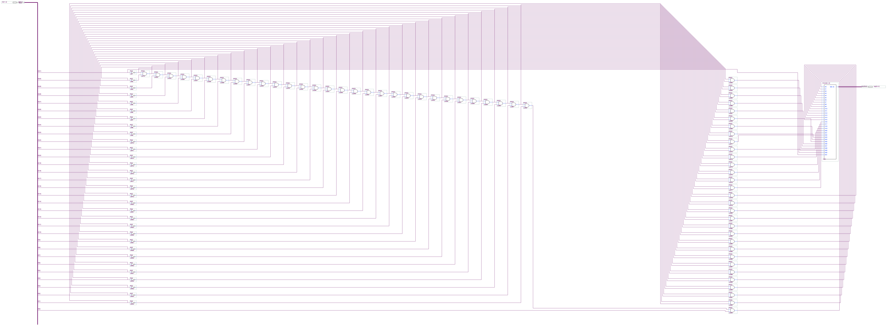

# Functionality
As the repository description suggests, this takes a 32 bit unsigned integer and returns a 5-bit integer denoting the base 2/binary logarithm of the input. Because the output is an integer, the logarithm is **floored**.
# TODO
- Need to test to ensure circuit behaves as intended
- As per Trevor's suggestion, we need to integrate our circuit into the existing ALU. Must complete testing *before* doing this.

